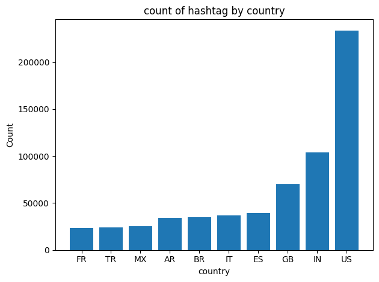

# Coronavirus twitter analysis

This project uses [MapReduce](https://en.wikipedia.org/wiki/MapReduce) to analyze all tweets related to Covid19 by country and language by processing geotagged tweets from a large-scale dataset in 2020. 

**Learning Objectives:**

1. work with large scale datasets
1. work with multilingual text
1. use the MapReduce divide-and-conquer paradigm to create parallel code

## Background

### 1. Mapping Tweets
```map.py``: takes geolocation information from tweets and plot them on a map to visualize where tweets are coming from
Extracted outputs from hashtags : .country and .lang files

Implementation: I created a shell script  ```run_map.sh``` which collected tweets from files of each dataset and runs ```map.py``` on that file, in addition to using ```reduce.py ``` to combine the outputs.

```
sh run_maps.sh &
```

### 2. Reduce
```reduce.py``: takes these intermediate outputs and aggregates them

Implementation:
```
$ python reduce.py --input_paths output_folder/geoTwitter*.lang --output_path=reduced.lang
```

### 3. Visualize
```visualize.py```: creates bar graphs and determines whether the visualization is for countries or languages based on the key
```alternativ_reduce.py```: creates a line graph representing hashtag trends over time

Implementation: 
```
python3 ./src/visualize.py --input_path=outputs/combined.countryry --key "#코로나바이러스"
python3 ./src/visualize.py --input_path=outputs/combined.lang --key "#코로나바이러스"
python3 ./src/visualize.py --input_path=outputs/combined.lang --key "#coronavirus"
python3 ./src/visualize.py --input_path=outputs/combined.countryry --key "#coronavirus"
```

```
python3 src/alternative_reduce.py --input_paths outputs/geoTwitter20-*-*.zip.lang --keys '#coronavirus' '#covid19' --output_path img/alternative-reduce.png
```


## Final Product

Count of #coronavirus by language


Count of #coronavirus by country


Count of #코로나바이러스 by language


Count of #코로나바이러스 by country


